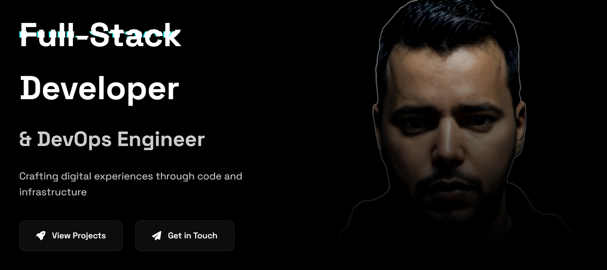

# StackHugs Portfolio



A modern, responsive portfolio website showcasing my work as a Full-Stack Developer & DevOps Engineer. Features a sleek glass-morphism design with dark/light mode compatibility.

## Features

- 🎨 Modern Glass-morphism Design
- 🌓 Dark/Light Mode Toggle
- 📱 Fully Responsive Layout
- ⚡ Optimized Performance
- 🔍 SEO Optimized
- 🖼️ Interactive Project Cards
- 🚀 Smooth Animations

## Recent Updates

### Project Section Enhancement (December 30, 2024)
- Added hover effects to project cards
- Project descriptions now appear on hover with smooth transitions
- Improved project tags and links display
- Enhanced visual feedback on interactions

### Performance Optimization (December 30, 2024)
- Implemented WebP image format with PNG fallback
- Added image lazy loading and async decoding
- Optimized critical asset loading
- Added preload directives for essential resources

### SEO Improvements (December 30, 2024)
- Added comprehensive meta tags
- Implemented Open Graph protocol for better social sharing
- Added Twitter Card meta tags
- Enhanced semantic HTML structure

## Technologies Used

- HTML5
- CSS3
- JavaScript
- Node.js (for image optimization)

## Development Tools

- Sharp (for image optimization)
- Git (version control)
- VS Code

## Image Optimization

The project includes an image optimization script (`optimize-images.js`) that converts images to the WebP format for better performance. To use it:

1. Install dependencies:
   ```bash
   npm install
   ```

2. Run the optimization script:
   ```bash
   node optimize-images.js
   ```

## Project Structure

```
stackhugs/
├── assets/
│   ├── css/
│   │   └── styles.css
│   ├── js/
│   │   └── script.js
│   └── images/
│       ├── hero-preview.png
│       ├── pro_image.png
│       └── pro_image.webp
├── index.html
├── package.json
├── optimize-images.js
└── README.md
```

## Setup and Development

1. Clone the repository:
   ```bash
   git clone https://github.com/Mizokuiam/stackhugs.git
   ```

2. Install dependencies:
   ```bash
   npm install
   ```

3. Open `index.html` in your browser to view the site.

## Contributing

Feel free to submit issues and enhancement requests!

## License

This project is licensed under the MIT License - see the LICENSE file for details.

## Contact

- Website: [stackhugs.com](https://mizokuiam.github.io/stackhugs/)
- GitHub: [@Mizokuiam](https://github.com/Mizokuiam)
